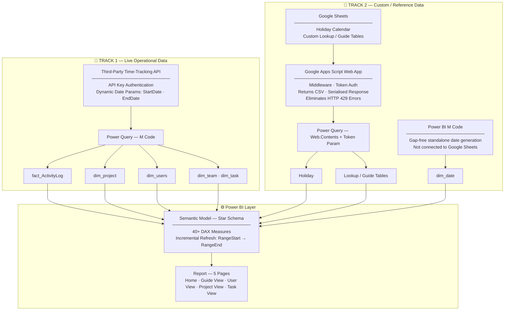

# OpsView — Ops Performance Dashboard

> A sanitised demo of a production-grade real-time operational dashboard built end-to-end for a client.


**Author:** [zeyamosharraf](https://github.com/zeyamosharraf)

---

## ⚠️ Demo Version — Read First

> [!IMPORTANT]
> **This is not the original client project.**
> - The real dashboard is built on a live third-party time-tracking API connected to the client's operational data. It cannot be shared due to sensitive business data and client confidentiality.
> - This repo contains a **structurally identical dummy version** where fake data mimics the real-world schema, volumes, and relationships.
> - Dummy data is **auto-generated weekly** via a Google Apps Script scheduled trigger to simulate a live data pipeline.
> - All real client credentials, API keys, tokens, and PII have been removed.
> - <!-- TODO: Add screenshots after dummy setup is complete -->

---

## 📌 Project Background & Objective

The client's operations team was maintaining all reporting manually — tracking project hours, team utilisation, and billing in Excel and Google Sheets. Each reporting cycle took **1–2 weeks** to compile, validate, and distribute.

**The goal:** fully automate the reporting pipeline and surface live operational data in Power BI so the team could make faster, data-driven decisions without waiting on manual spreadsheets.

**Scope:** Operational metrics only — hours, utilisation, project health, team performance. Cost analysis was excluded and built as a **separate dashboard** due to the sensitivity of salary and billing rate data.

**Consulting role included:**
- Designing the MoM metric framework (current vs. previous month comparisons)
- Building complex DAX calculations from scratch
- Advising on RLS implementation feasibility (page-level RLS was researched and found to be unsupported in Power BI — documented in [Engineering Challenges](#-engineering-challenges--solutions))

**Outcome:** Reporting time reduced from **1–2 weeks → ~10 minutes**. The dashboard surfaces near-real-time data on every scheduled refresh.

---

## 🏗️ System Architecture

Two separate data tracks feed the Power BI semantic model.



### Engineering callouts

| Decision | Why |
|----------|-----|
| **Middleware only for Google Sheets, not the API** | Power BI fires 2+ parallel requests during refresh when using direct Google Sheets links → HTTP 429. The Apps Script Web App serialises these into a single controlled response per call. The third-party API is a proper REST endpoint with no such throttling issue. |
| **API key auth (not email/password)** | The original login-based token expired frequently, silently breaking daily scheduled refreshes. Migrated to API key authentication for a stable, long-lived credential. |
| **`dim_date` built in Power BI via M code** | Tying the date table directly to the fact table caused date gaps and broken time-intelligence calculations. A standalone M-generated date table provides a complete, gap-free calendar independent of data coverage. |
| **Star schema** | Clean one-to-many relationships, optimal DAX filter propagation, and correct time-intelligence support across all report pages. |

---

## 📋 Report Pages

| # | Page | Purpose |
|---|------|---------|
| 1 | **Home** | Navigation landing page |
| 2 | **Guide View** | Instructions and metric definitions for end users |
| 3 | **User View** *(default)* | Per-employee breakdown: billable hours, utilisation, leave, contribution % |
| 4 | **Project View** | Project-level: budget status, billable hours, ranking |
| 5 | **Task View** | Activity breakdown at the task level |

> All pages: 1280 × 720 px · Fit to Page · B2BI custom theme
>
> <!-- TODO: Add screenshots for each page after dummy setup is complete -->

---

## 🗄️ Data Model

### Tables

| Table | Type | Source | Description |
|-------|------|--------|-------------|
| `fact_ActivityLog` | Fact | API | Core transaction table — one row per time log entry (user, project, task, date, hours, billable flag) |
| `dim_project` | Dimension | API | Project metadata: name, team, priority, payment type, start date, churn date, budget hours, status |
| `dim_users` | Dimension | API | Employee records: ID, name, email, team, join/resign dates, archived status |
| `dim_team` | Dimension | API | Team lookup |
| `dim_task` | Dimension | API | Task name lookup |
| `dim_date` | Dimension | M Code | Standalone gap-free date table with weekday flags, holiday type, week labels, YearMonth |
| `Holiday` | Reference | Google Sheets → Apps Script | Public and fixed holiday calendar, joined to `dim_date` |
| `dim_refresh_date` | Reference | Google Sheets → Apps Script | Tracks last successful data refresh timestamp |
| `Measure` | Calc only | — | Disconnected table holding all 40+ DAX measures, organised by display folder |

### Normalisation decisions

- `dim_team` and `dim_task` were extracted from `fact_ActivityLog` as standalone dimensions to support independent filtering and cleaner relationships (INT-021).
- `dim_date` was rebuilt from scratch via M code after the original fact-joined date table caused missing-date errors and slicer failures (INT-019).
- Project data that was previously embedded in project name strings (start date, payment type, category) was extracted via M code and later sourced directly from the API backend (INT-008).

---

## 📐 Key Metrics & Measures

All DAX measures live in a disconnected `Measure` table, organised by display folder.

### Core KPIs

| Measure | Logic |
|---------|-------|
| `Total Billable Hours` | `SUM(Hours) WHERE Is Billable = TRUE` |
| `Total Non Billable Hours` | `SUM(Hours) WHERE Is Billable = FALSE` |
| `Available Capacity` | `Active Users × Working Days × 9 hrs` — excludes weekends and fixed holidays |
| `Overall Utilization` | `Total Billable Hours / Available Capacity` |
| `Budget Hours` | Retainer projects: monthly allocation summed per active month. Fixed/Hourly projects: total project budget. Combined via SUMX over SUMMARIZE. |
| `Budget Spent %` | `Total Billable Hours / Budget Hours` |

### Month-over-Month (MoM)

MoM measures compare **Current Month (CM)** vs **Previous Month (PM)** for: Billable Hours, Non-Billable Hours, Utilisation %, Budget Hours, Leave count.

Each MoM metric ships with:
- A percentage change measure
- An arrow label (▲ / ▼) formatted via UNICHAR
- A conditional color measure (Green / Red / Yellow) based on business thresholds

### Advanced patterns

| Pattern | Implementation |
|---------|---------------|
| **Budget Hours** | Separates Retainer (monthly `MAX`) from Fixed/Hourly (project-total `MAX`) via `SUMMARIZE + FILTER + ADDCOLUMNS`. Removes user filter with `REMOVEFILTERS`. |
| **Pagination** | `RANKX` on the selected measure → page number slicer controls which ranked items display. Avoids native Top N limitations. |
| **Dynamic time grain** | Parameter toggle (Week / Month) drives slicer and DAX `SELECTEDVALUE` to switch the X-axis in trend visuals without duplicating charts. |
| **Dynamic metric toggle** | Parameter toggle (Billable / Non-Billable, Payment Type / Category) controls measure selection via `SELECTEDVALUE` in a single visual. |
| **Project status classification** | `Project Budget Status` — `SWITCH(TRUE(), ...)` to classify each project as Over-Budget, Under-Budget, On-Track, or Others. |
| **Utilisation colour coding** | Traffic-light conditional formatting: 🔴 < 50% · 🟡 50–70% · 🟢 ≥ 70% |

---

## 🔧 Engineering Challenges & Solutions

Documented in **Problem → Root Cause → Solution** format by theme.

### API & Authentication

**Problem:** Initial API connection used email/password token which expired unpredictably, breaking daily scheduled refreshes. Power BI showed "Credential is not valid" errors intermittently.

**Root cause:** Login-based tokens have short TTLs and are invalidated on session changes. Power BI's scheduled refresh has no mechanism to re-authenticate interactively.

**Solution:** Fully migrated all Power Query M code (Users, Projects, Clients, Activity Log) from email/password auth to API key authentication. Tested endpoint in Postman before rewriting M code. Removed old auth query steps, renamed the `APIKey` parameter for clarity. End-to-end refresh validated post-migration. *(INT-089-A → INT-089-E)*

---

**Problem:** Direct Google Sheets links in Power Query caused HTTP 429 (Too Many Requests) during refresh.

**Root cause:** Power BI sends two or more parallel requests to the same source during a refresh cycle. Google Sheets rate-limits this and returns 429.

**Solution:** Deployed a Google Apps Script Web App as a middleware layer — one endpoint per sheet, token-authenticated, returning CSV. The Web App handles a single request at a time, serialising Power BI's parallel calls into controlled sequential responses. *(INT-090, INT-091)*

---

### Data Modelling

**Problem:** `dim_date` tied to `fact_ActivityLog` caused date gaps — days with no logged hours were missing from the date table, breaking time-intelligence calculations and leaving slicer holes.

**Root cause:** Auto-generating a date table from a fact table produces only the dates present in data, not a complete calendar.

**Solution:** Deleted the fact-linked date table and rebuilt `dim_date` using pure M code — a generated sequence from `StartDate` to `Today()`, independent of any data table. *(INT-019)*

---

**Problem:** `dim_team` and `dim_task` did not exist as separate tables. Team and task data were mixed directly in `fact_ActivityLog`, making independent filtering unreliable.

**Root cause:** Original data model was not normalised — no star schema.

**Solution:** Extracted distinct team and task values from the fact table into separate dimension tables. Rebuilt relationships. *(INT-021)*

---

### DAX & KPI Logic

**Problem:** MoM measures returned incorrect results when category slicers (Payment Type, Project Name) were applied — they leaked filter context.

**Root cause:** MoM logic used `DATEADD` which respects existing filter context. When a category slicer was applied, the previous-month calculation filtered on the same category, sometimes producing blank or wrong values.

**Solution:** Rewrote all MoM measures using explicit `CALCULATE + FILTER(ALL('dim_date'), ...)` blocks with dedicated current-month and previous-month date boundaries. Isolated date context from category context. *(INT-073)*

---

**Problem:** `Budget Hours` measure gave incorrect results for retainer projects — it was treating the total project budget instead of the active monthly allocation.

**Root cause:** Retainer projects have a monthly committed hours figure. Summing directly across months overcounted.

**Solution:** Rebuilt the measure using `SUMX(SUMMARIZE(..., dim_date[YearMonth], "MonthlyBudget", MAX(Budget Hours)), [MonthlyBudget])` filtered to retainer payment type and active period (before churn date). *(INT-051)*

---

### UX & Visual Design

**Problem:** Dashboard had no consistent layout standard — charts, KPI cards, and slicers were positioned inconsistently across pages.

**Root cause:** Visual design was built iteratively without a reference prototype.

**Solution:** Designed background layouts in Figma for all three main views (Project, User, Team) as a clickable prototype. Implemented layout in Power BI using background images exported from Figma. Applied a unified brand colour scheme and consistent font sizing. *(INT-069, INT-083, INT-084)*

---

**Problem:** Default Power BI tooltips gave no meaningful context for the "Project by Team Name" chart.

**Solution:** Built a custom tooltip page with an embedded bar chart showing project breakdown by category (P1, P2, etc.) — surfaces depth without cluttering the main visual. *(INT-077)*

---

### RLS — Known Limitation

**Research finding:** Page-level RLS (restricting which report pages a user can see) is **not supported** in Power BI. Only report-level and row-level RLS are available.

Power BI documentation, community threads, and DAX/bookmark-based workarounds were all tested. No reliable page-level control exists natively.

**Documented as a known platform limitation.** The client was advised on report-level RLS as an alternative. *(INT-078)*

---

[View full issue log (91 entries) →](docs/ISSUE_LOG.md)

---

## ⚙️ Data Source Configuration

### Track 1 — API Source

1. Obtain an API key from the time-tracking platform.
2. In Power BI Desktop: **Transform Data → Manage Parameters**
3. Update:
   - `Auth_Token` — your API key string
   - `StartDate` — default start date for data load (e.g. `2025-01-01`)
   - `RangeStart` / `RangeEnd` — incremental refresh window
4. Refresh to validate the connection.

### Track 2 — Google Sheets Middleware

1. Open each reference Google Sheet.
2. Go to **Extensions → Apps Script** and deploy as a Web App:
   - Execute as: **Me**
   - Who has access: **Anyone** (or restrict by domain)
   - Note the `/exec` URL generated on deploy.
3. In Power BI Desktop: **Transform Data → Manage Parameters**
4. Update each `Web_app_url_*` parameter with the corresponding `/exec` URL.
5. Set `Auth_Token` to match the token string validated inside your Apps Script.

> [!CAUTION]
> Do not commit real `Auth_Token` values or `/exec` URLs to version control. Use Power BI Gateway environment variables or a `.env`-style approach for production deployments.

---

## 📁 Project Structure

```
ops-performance-dashboard/
│
├── Ops Performance.pbip                   # PBIP entry point
│
├── Ops Performance.Report/                # Report definition
│   ├── definition/
│   │   ├── report.json                    # Report-level settings & theme refs
│   │   ├── pages/
│   │   │   ├── pages.json                 # Page order & active page
│   │   │   ├── <page-id>/page.json        # Per-page layout & background
│   │   │   └── <page-id>/visuals/         # Visual definitions per page
│   │   └── bookmarks/                     # Saved bookmark states
│   └── StaticResources/                   # Embedded theme & nav images
│
├── Ops Performance.SemanticModel/         # Data model definition
│   ├── definition/
│   │   ├── model.tmdl                     # Model settings & query groups
│   │   ├── expressions.tmdl              # Parameters (URLs, tokens, dates)
│   │   ├── relationships.tmdl            # Table relationships
│   │   └── tables/                       # One .tmdl file per table
│   │       ├── fact_ActivityLog.tmdl
│   │       ├── dim_project.tmdl
│   │       ├── dim_users.tmdl
│   │       ├── dim_team.tmdl
│   │       ├── dim_task.tmdl
│   │       ├── dim_date.tmdl
│   │       ├── Holiday.tmdl
│   │       ├── Measure.tmdl              # All DAX measures
│   │       └── ...                       # Parameter & local date tables
│   └── diagramLayout.json                # Model diagram canvas layout
│
└── docs/
    └── ISSUE_LOG.md                       # Full 91-entry engineering issue log
```

---

## 🚀 Getting Started

### Prerequisites
- **Power BI Desktop** (latest version recommended)
- PBIP format requires **Developer Mode** enabled in Power BI Desktop preview features

### Enable PBIP / Developer Mode
1. **File → Options and Settings → Options**
2. Under **Preview features**, enable **Power BI Project (.pbip) save format**
3. Restart Power BI Desktop

### Open the Report
1. Clone or download this repository
2. Open `Ops Performance.pbip` in Power BI Desktop
3. Configure data source parameters (see [Data Source Configuration](#️-data-source-configuration))
4. Click **Refresh All**

---

## 🔄 Refresh & Maintenance

### Dummy data (this repo)
- Fake data is auto-generated **weekly** via a Google Apps Script time-based trigger
- The trigger writes to the underlying Google Sheets, which are then served via the Apps Script Web App endpoints
- No manual action required to keep the demo data current

### Swapping in real endpoints
1. Replace all `Web_app_url_*` parameters with your real Apps Script `/exec` URLs
2. Replace the `Auth_Token` with the token configured in your real Apps Script
3. For the API source, replace the URL base and `Auth_Token` with your API key
4. Update `RangeStart` / `RangeEnd` to match your desired incremental refresh window
5. Publish to Power BI Service and configure a scheduled refresh via the on-premise gateway if required

### Adding new data
- New teams, projects, or users: update the source (API backend or Google Sheet) — the next refresh picks them up automatically
- New DAX measures: edit `Ops Performance.SemanticModel/definition/tables/Measure.tmdl`, follow existing display-folder naming conventions

---

*Built with Power BI PBIP format — version-control-friendly and team-collaboration ready.*
